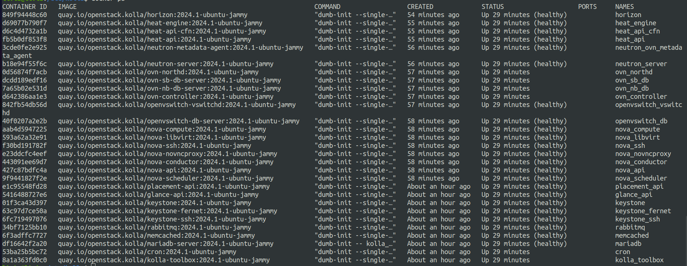
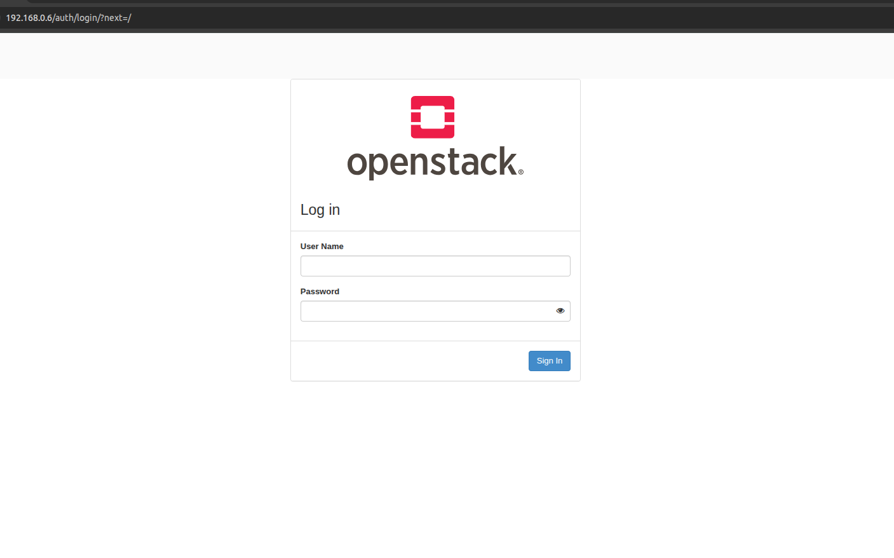

# 😾 Instalação do OpenStack 2024.1 (Caracal)

Este laboratório documenta a instalação do OpenStack 2024.1 utilizando o **Kolla Ansible** em um ambiente **All-in-One**.

## 🖥️ Ambiente Utilizado

O laboratório foi executado em uma máquina virtual com a seguinte configuração:

- **Sistema operacional**: Ubuntu Server 24.04 (clean install)
- **CPU:** 8 vCPUs
- **Memória RAM:** 16 GB
- **Disco:** 40 GB
- **Acesso:** Usuário com privilégios `sudo`
- **Rede:**
  - `enp0s3` – Interface externa via DHCP (rede NAT pública)
  - `enp0s8` – Interface de gerenciamento com IP estático (rede Bridge interna)

## ⚙️ Etapas de Instalação

### 1. Atualizações e dependências

```bash
sudo apt update && sudo apt upgrade -y

sudo apt install -y git python3-dev libffi-dev gcc libssl-dev python3-venv
```

### 2. Configuração de Rede

#### 2.1 Definição do arquivo Netplan

```bash
cat <<EOF > /etc/netplan/<netpan-file>
network:
  version: 2
  ethernets:
    enp0s3:
      dhcp4: true
    enp0s8:
      addresses:
        - 192.168.0.6/24
      gateway4: 192.168.0.1
      nameservers:
        addresses:
          - 8.8.8.8
          - 1.1.1.1
EOF
```

#### 2.2 Aplicação das configurações de rede

```bash
sudo netplan try

sudo netplan apply
```

### 3. Instalação do Kolla Ansible

#### 3.1 Criação do ambiente virtual Python

```bash
sudo apt install python3-venv

python3 -m venv venv

source venv/bin/activate

pip install -U pip
```

#### 3.2 Instalação do Ansible e Kolla Ansible

```bash
pip install 'ansible-core>=2.15,<2.16.99'

pip install git+https://opendev.org/openstack/kolla-ansible@stable/2024.1
```

### 4. Preparação do Ambiente

#### 4.1 Criação de diretórios e cópia dos arquivos de configuração

```bash
sudo mkdir -p /etc/kolla
sudo chown $USER:$USER /etc/kolla

cp -r venv/share/kolla-ansible/etc_examples/kolla/* /etc/kolla

cp venv/share/kolla-ansible/ansible/inventory/all-in-one /etc/kolla
```

### 5. Configuração do globals.yml

Configurações aplicadas o arquivo `/etc/kolla/globals.yml`:

```yaml
workaround_ansible_issue_8743: yes
kolla_base_distro: 'ubuntu'
openstack_release: '2024.1'
kolla_internal_vip_address: '192.168.0.6'
network_interface: 'enp0s8'
neutron_external_interface: 'enp0s3'
neutron_plugin_agent: 'ovn'
enable_openstack_core: 'yes'
enable_glance: '{{ enable_openstack_core | bool }}'
enable_haproxy: 'no'
enable_keystone: '{{ enable_openstack_core | bool }}'
enable_mariadb: 'yes'
enable_memcached: 'yes'
enable_neutron: '{{ enable_openstack_core | bool }}'
enable_nova: '{{ enable_openstack_core | bool }}'
enable_rabbitmq: "{{ 'yes' if om_rpc_transport == 'rabbit' or om_notify_transport == 'rabbit' else 'no' }}"
enable_cinder: 'no'
enable_cinder_backup: 'no'
enable_fluentd: 'no'
enable_horizon: '{{ enable_openstack_core | bool }}'
nova_compute_virt_type: 'qemu'
nova_console: 'novnc'
```

### 6. Deploy do Openstack

```bash
cd /etc/kolla

kolla-ansible install-deps
kolla-genpwd

kolla-ansible -i ./all-in-one bootstrap-servers

kolla-ansible -i ./all-in-one prechecks

kolla-ansible -i ./all-in-one deploy
```

## ✅ Teste de Instalação

Após o deploy, execute os seguintes passos para validar o ambiente:

### 1. Verificação dos containers

Confirme se todos os containers Kolla estão em execução corretamente:

```bash
sudo docker ps
```

Procure pelos containers essenciais, como Keystone, Glance, Nova, Neutron, Horizon e RabbitMQ:



### 2. Acesso à interface Horizon

No navegador, acesse o endereço configurado no `kolla_internal_vip_address` (192.168.0.6):



### 📚 Referências

- [Kolla Ansible Quickstart 2024.1](https://docs.openstack.org/kolla-ansible/2024.1/user/quickstart.html)
- [Documentação oficial OpenStack](https://docs.openstack.org/2024.1/index.html)
